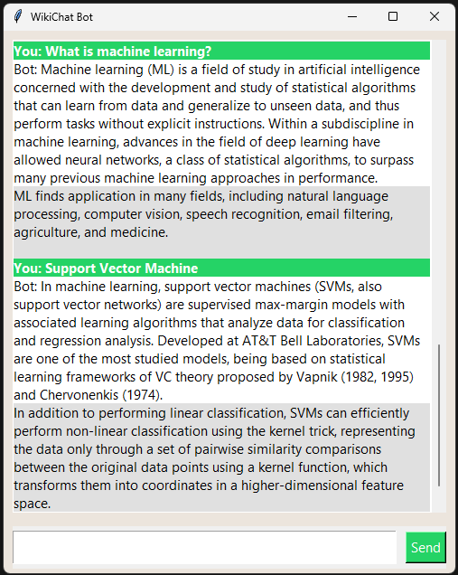

# wiki-chat-bot-version-1.0🧠📚

**WikiChat Bot** is a simple personal chatbot that looks like WhatsApp and responds to user queries by fetching summary paragraphs from Wikipedia. This is **Version One (v1.0)** of a bigger **Natural Language Processing (NLP)** project aiming to build a fully functional personal assistant chatbot.

## 🚀 Project Purpose

This project demonstrates the early foundation of a personal chatbot that can:
- Respond to any topic query using the Wikipedia library.
- Provide quick summaries in a clean, WhatsApp-style GUI.
- Allow natural communication (just like chatting with a friend).
- Be easily expanded with more NLP features in future versions.

## 🛠 Features

- 📖 Fetches a paragraph from Wikipedia based on user input.
- 🗨️ Chat UI inspired by WhatsApp (different colors for user and bot).
- ⌨️ Press Enter to send messages quickly.
- 🌐 Supports any topic available in English Wikipedia.

## 🧠 Possibilities with `wikipedia` Library

Using the `wikipedia` Python library, personal chatbots can:
- Act as quick knowledge assistants (like mini-Wolfram or Siri).
- Answer general knowledge questions from hundreds of topics.
- Summarize historical figures, technologies, or events.
- Provide multi-language support (with minor tweaks).
- Be integrated with speech-to-text or voice responses.
- Offer follow-up question capabilities (via NLP pipelines).

## 📈 Future Goals (Version Two and Beyond)

- 🤖 Intent recognition (e.g., greetings, facts, jokes, weather).
- 🧠 NLP-powered context retention for follow-up conversations.
- 🗣️ Voice command support using SpeechRecognition.
- 📊 Integration with other APIs (news, weather, jokes).
- 🧾 Save and reload previous chat history.
- 🧪 Advanced AI response generation using LLMs (like GPT).

## 📦 Requirements

- Python 3.x
- `wikipedia`
- `tkinter` (comes with standard Python installation)

Install dependencies:

```bash
pip install wikipedia
```

## 💡 How to Run

```bash
python wikibot.py
```

Start typing topics like:

- `What is machine learning?`
- `Neural network`
- `Difference between regression and classification`
- `Natural language processing`

…and get instant Wikipedia summaries in a WhatsApp-style window!

## 📌 Screenshots



---

Future versions coming soon 🚧
